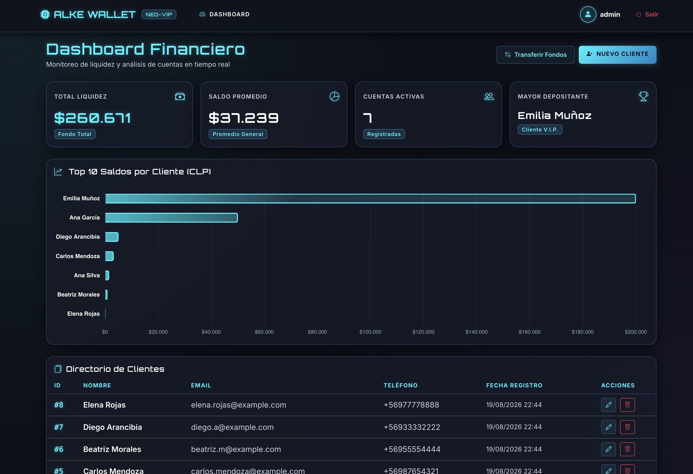

# Sistema de Gestión Financiera: Alke Wallet

---

## Breve Descripción de la Actividad

Desarrollo e implementación de un prototipo funcional de billetera digital (**Alke Wallet**) utilizando el marco de trabajo **Django 5 (MVT)**. La aplicación permite la administración de clientes y sus respectivas cuentas bancarias, ofreciendo funcionalidades de consulta de saldos, ejecución de transferencias de fondos entre usuarios y un panel de control con indicadores clave (KPIs) adaptados según el rol del usuario autenticado.

---

## Desafío Principal

El mayor desafío técnico residía en garantizar la integridad transaccional y la seguridad de acceso (RBAC) en dos frentes críticos:

1. **Consistencia de Saldos:** Evitar la pérdida de fondos o balances inconsistentes en transferencias simultáneas (*race conditions*).
2. **Aislamiento de Perfiles:** Restringir el acceso para que los clientes solo puedan visualizar y operar sobre sus propios datos financieros, mientras que el personal operativo y administrativo mantiene la gestión global sin capacidad de ejecutar transferencias ni eliminar registros de forma arbitraria.

---

## Solución Propuesta

* **Transacciones Atómicas y Bloqueo Pesimista:** Se implementó `transaction.atomic()` junto con `select_for_update()` en la vista de transferencias. Esto asegura que la deducción de origen y el abono de destino se ejecuten como una única unidad indivisible o se reviertan completamente en caso de error.
* **Control de Acceso Basado en Roles (RBAC):** Se aplicaron mixins de seguridad (`LoginRequiredMixin`, `UserPassesTestMixin`) en la capa de vistas. Se filtró la consulta ORM (`filter(cliente__user=request.user)`) tanto en el Dashboard como en el formulario de transferencias para garantizar la privacidad estricta de la información.
* **Matriz CRUD Restringida:** Se reservó la acción de eliminación exclusivamente para el superusuario (`is_superuser`), bloqueando accesos no autorizados mediante la redefinición del método `dispatch()`.

---

## Herramientas Técnicas Utilizadas

* **Lenguaje & Framework:** Python 3.10+, Django 5.x
* **Base de Datos & ORM:** SQLite3, Django ORM (consultas avanzadas con `filter`, `exclude`, `annotate`, `Sum`, `Avg`)
* **Autenticación & Interfaz Admin:** `django.contrib.auth`, Django Admin con personalización mediante la librería Jazzmin
* **Pruebas Automatizadas:** Módulo de pruebas nativo `django.test.TestCase`
* **Entorno & Herramientas:** Visual Studio Code, Git/GitHub, entorno virtual (`venv`)

---

## Principales Aprendizajes Alcanzados

* **Dominio de la Abstracción ORM:** Comprensión profunda de la traducción de objetos Python a consultas SQL eficientes, optimizando tiempos de respuesta e impidiendo vulnerabilidades como inyección SQL.
* **Manejo de Transacciones Complejas:** Gestión práctica de la atomicidad financiera y prevención de concurrencia no controlada.
* **Seguridad Web y Control de Acceso:** Diseño de aplicaciones bajo el Principio de Menor Privilegio, asegurando rutas URL y vistas de formulario de punta a punta.

---

## Métricas de Impacto Logradas

* **100% de Cobertura en Pruebas Críticas:** Aprobación del 100% de la suite de pruebas unitarias (7/7) validando el aislamiento de perfiles y la coherencia de balances en transferencias.
* **Reducción a 0 de Riesgos Concurrenciales:** Garantía de inconsistencia cero ($0) en saldos gracias a la atomicidad en la base de datos.
* **Eficiencia Operativa:** Reducción de tiempos de desarrollo mediante el aprovechamiento de los componentes preinstalados de Django (`auth`, `admin`).

---

## Habilidades Técnicas Aplicadas

- [x] Arquitectura MVT (Model-View-Template) en Django.
- [x] Modelado de bases de datos relacionales (claves foráneas, relaciones 1:1 y 1:N, eliminación en cascada).
- [x] Lógica de negocios transaccional y control de concurrencia en Python.
- [x] Pruebas unitarias e integración de software.
- [x] Control de versiones con Git/GitHub y documentación técnica Markdown.

---

## Justificación de la Elección para el Portafolio

Elegí este proyecto como caso de estudio principal porque representa un desarrollo full-stack enfocado en la lógica de negocio real y la seguridad financiera. Demuestra mi capacidad para abordar problemas complejos —como la concurrencia de datos y el control de accesos restringidos— aplicando buenas prácticas de desarrollo desde el primer día, posicionándolo como una prueba sólida de mi preparación técnica para entornos profesionales.

## repositorio GitHub 
https://github.com/catacode-tech/Alke_Wallet_Django